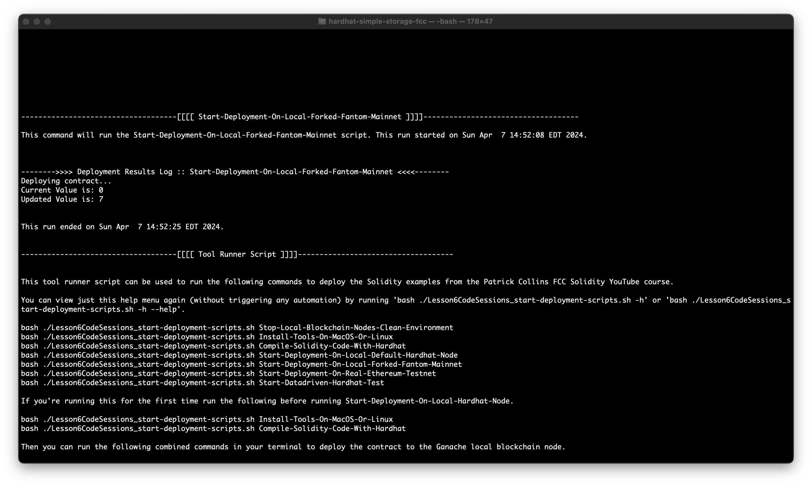
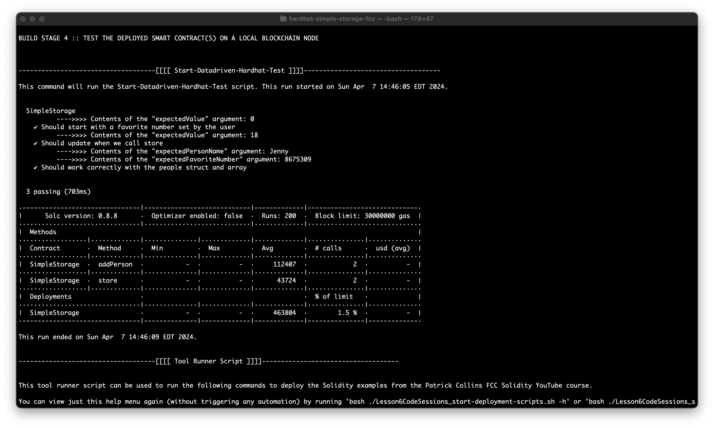
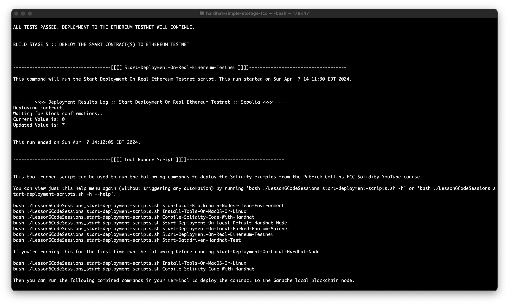
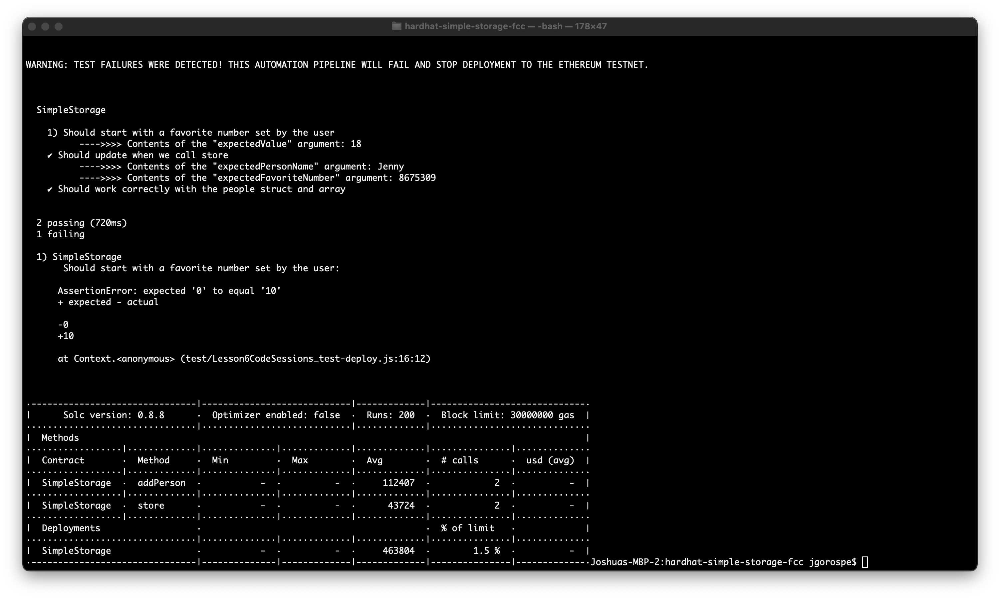

These are my notes while working on [Patrick's Javascript Blockchain/Smart Contract FreeCodeCamp Course](https://www.youtube.com/watch?v=gyMwXuJrbJQ).

- On April 7, 2024 successfully compiled and deployed the following "Hardhat smart contract deployment and local Hardhat Node" example code to interact with a locally installed Hardhat fake blockchain node. I made a lot of changes to Patrick's original deployment code, and also included a Fantom mainnet forking script to create a local Fantom Hardhat Node deployment.

- On April 7, 2024 I also created enhancements to Patrick's tests to make them into a datadriven library that can be used by other automation frameworks.

- On April 7, 2024 I also created an enhanced Hardhat automation pipeline script that stops an Ethereum Testnet deployment if any test failures are detected. This automation pipeline script will work exactly the same for an Ethereum Mainnet deployment.

Build pipeline success example:

Build pipeline failure example:

Here is one of several contracts I deployed with this build pipeline to Sepolia Testnet using my own Alchemy Sepolia Testnet RPC.
  - https://sepolia.etherscan.io/address/0x283dc8314ff2b950ec4bf2b6dcfdbb1c67bca073
